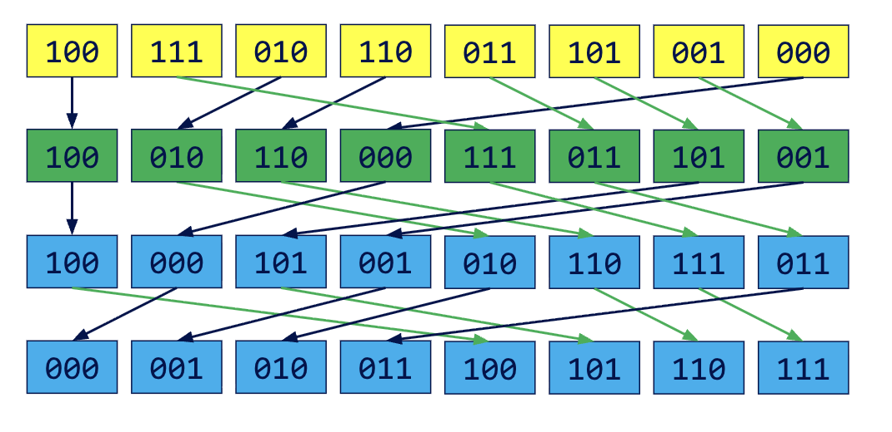

CUDA Stream Compaction
======================

**University of Pennsylvania, CIS 565: GPU Programming and Architecture, Project 2**

* Marcus Hedlund
  * [LinkedIn](https://www.linkedin.com/in/marcushedlund/)
* Tested on: Windows 11, Intel Core Ultra 9 185H @ 2.5 GHz 16GB, NVIDIA GeForce RTX 4070 Laptop GPU 8GB (Personal Computer)


# Overview

In this project I implemented multiple versions of the exclusive scan (prefix sum) algorithm and used them to build stream compaction and radix sort. The implementations range from a baseline CPU version to a work efficient GPU version using shared memory and memory bank conflict avoidance. I also compared my implementations against Thrust's implementation of scan for performance benchmarking.

First, a brief description of each algorithm:
* Scan: Calculate all prefix sums of an array
* Stream Compaction: Given an array, create a new array with all elements that fit a certain criteria
* Radix Sort: Efficiently sort an integer array by processing individual bits

||||
|:--:|:--:|:--:|

<p align="center"><i>Scan, Stream Compaction, and Radix Sort adapted from CIS 5650 slides</i></p>

# Implementations

### CPU Baselines

The CPU versions of all three algorithms are straightforward:
* Scan: We use a for loop that iterates through the array while maintaining a running sum
* Stream Compaction: We use a two-pointer approach while iterating through the array keeping track of both our current element and where the next desired element should go.
* Sort: We simply use std::sort as a reference to check my GPU implementation of radix sort

### Naive GPU Scan
The naive scan works through the prefix sum problem in a series of kernel launches. In each pass, every thread updates its element by adding the value of an element at a certain offset earlier in the array. By updating the array in place and doubling the offset each pass, by the end of `ilog2(n)` total passes each element will hold the sum of all of the previous values. 
||
|:--:|
|GPU Naive Scan from CIS 5650 slides|

### Work Efficient GPU Scan
To improve on the naive approach, work efficient scan organizes the array as a balanced binary tree and computes the prefix sums in two phases. In the upsweep phase, threads do a parallel reduction that combines elements to create partial sums going up the tree until the root holds the total sum. The downsweep phase then traverses down the tree, piecing the sums together to compute the correct prefix sum values at each leaf.
||
|:--:|:--:|
|Work Efficient Upsweep from CIS 5650 slides|Work Efficient Downsweep from CIS 5650 slides|


### Shared Memory GPU Scan
The shared memory GPU scan is based on the work efficient implementation but leverages shared memory over global memory to improve lookup speed. Each thread loads two elements from global memory into shared memory so that each block can process up to 2048 elements effectively. For arrays larger than 2048 elements, we first divide the original array into tiles of length 2048 that are then processed in parallel with the total sums of each tile being stored into a block sums array. This block sums array is then itself scanned using the shared memory implementations and the results are added back to each tile to compute the final prefix sums.

<p align="center">
  
  <br>
  <i>Shared Memory Scan from GPU Gems 39.2.4</i>
</p>


### Thrust Scan
I also made a simple wrapper around Thrust's scan function to compare my implementations against.

### GPU Stream Compaction
The GPU implementation of stream compaction directly leverages scan. First, the input array is mapped to a boolean array based on which elements should be kept. Next, the boolean array is scanned to produce an array of target indices. Finally, a scatter step writes each desired element into its correct position in the compacted array by using both the boolean and scan outputs.

|
|:--:|
|GPU Stream Compaction from CIS 5650 slides|

### GPU Radix Sort
Lastly, I implemented radix sort on the GPU leveraging both scan and scatter. Radix sort works by processing the binary representation of each integer starting from the least significant bit until the most significant. At each iteration, the algorithm partitions the array so that all elements with a zero in the current bit appear before any with a one, while preserving the relative order of elements in each of the partitions.
|
|:--:|
|CPU Radix Sort from CIS 5650 slides|

On the GPU each iteration is performed by first mapping each element to a boolean array based on the current bit. Then, in several steps including a scan pass we calculate the new positions to scatter each element to. Lastly, we scatter the elements based on the boolean and new position arrays. Repeating this process for each bit gives us the fully sorted array.
|||
|:--:|:--:|
|GPU Radix Sort scan step from CIS 5650 slides| GPU Radix Sort scatter step from CIS 5650 slides|

# Performance Analysis

### Data Collection

For performance measurement I used `std::chrono` to record CPU timings and CUDA events for GPU timings. All GPU measurements excluded initial and final memory operations such as copying data to and from the host and device for fair comparison. Additionally each data point was collected over ten trials and then averaged, and the complete data can be found in the [data](https://github.com/mhedlund7/Project2-Stream-Compaction/tree/main/data) folder.

### Varying Block Count


For all the implementations varying the block size did not have a large effect on performance. In general, a block size of 256 threads seemed to work pretty well across all implementations, though the work efficient scan showed slightly better performance at 128 threads and the naive scan was slightly better at 256 threads. Overall though the block size did not seem like a major factor towards increasing the speed of the implementations.

### Varying Array Size

|||
|:--:|:--:|
|Various Implementations: Time vs Array Size|Shared Memory vs Global Memory Comparison|

When varying array size though the results were much clearer. The CPU and naive GPU scans performed the worst for large inputs, with the naive GPU scan surprisingly even falling behind the CPU likely because of how much global memory usage it needs each iteration. The work efficient GPU scan greatly improved over both the previous implementations and using shared memory optimized it even further with the largest gains at nearly a ten times speedup compared to the normal work efficient version. Thrust's scan however consistently outperformed all of my results although my shared memory implementation came quite close on smaller array sizes. By profiling with Nsight Compute I was able to look more into these differences:

### Performance Comparisons

|||
|:--:|:--:|
|Naive NSIGHT Compute Output|Work Efficient NSIGHT Compute Output|
||||
|Shared Memory NSIGHT Compute Output|Thrust NSIGHT Compute Output|

In Nsight Compute each iteration of the naive implementation shows a memory throughput utilization of around 80% while the work efficient version also reaches around 80% early in the upsweep and late in the downsweep, but utilizes less memory when it launches fewer threads higher up in the tree. Even so it is clear that their performances were both primarily memory-bound. By contrast, the shared memory scan reduced memory throughput to around 25% during the tiled scan step, allowing it to have higher computation and greatly improve performance, but it was still restricted at around 84% when adding all of the block sums back to their respective tiles because it isn't leveraging shared memory during that step. Thrust's implementation also had lower memory throughput at around 65% and was able to better balance both its memory access and actual computation.

### Radix Sort Array Size

Lastly, for Radix Sort we can see a clear linear relationship as the size of the array grows, as expected (appears exponential here because of the log-scaled graph). I configured my radix sort to do 16 passes in order to support integers up to 1 million, but this number could be decreased to gain speed, or increased in order to handle larger integers if needed.

### Sample Program Output
I added additional tests for radix sort comparing against the result of std::sort and also tested my shared memory scan implementation. Radix sort can be called through `StreamCompaction::Radix::radix(int n, int *odata, const int *idata)`.
```
****************
** SCAN TESTS **
****************
    [  18  12  23   7  17  14  27  46  43  43  48  42   0 ...  24   0 ]
==== cpu scan, power-of-two ====
   elapsed time: 0.0062ms    (std::chrono Measured)
    [   0  18  30  53  60  77  91 118 164 207 250 298 340 ... 100095 100119 ]
==== cpu scan, non-power-of-two ====
   elapsed time: 0.0042ms    (std::chrono Measured)
    [   0  18  30  53  60  77  91 118 164 207 250 298 340 ... 100026 100053 ]
    passed
==== naive scan, power-of-two ====
   elapsed time: 0.3072ms    (CUDA Measured)
    passed
==== naive scan, non-power-of-two ====
   elapsed time: 0.34816ms    (CUDA Measured)
    passed
==== work-efficient scan, power-of-two ====
   elapsed time: 0.841728ms    (CUDA Measured)
    passed
==== work-efficient scan, non-power-of-two ====
   elapsed time: 1.56262ms    (CUDA Measured)
    passed
==== thrust scan, power-of-two ====
   elapsed time: 1.9159ms    (CUDA Measured)
    passed
==== thrust scan, non-power-of-two ====
   elapsed time: 0.063488ms    (CUDA Measured)
    passed
==== shared mem work-efficient scan, power-of-two ====
   elapsed time: 0.176128ms    (CUDA Measured)
    [   0  18  30  53  60  77  91 118 164 207 250 298 340 ... 100095 100119 ]
    passed
==== shared mem work-efficient scan, non-power-of-two ====
   elapsed time: 0.294912ms    (CUDA Measured)
    [   0  18  30  53  60  77  91 118 164 207 250 298 340 ... 100026 100053 ]
    passed

*****************************
** STREAM COMPACTION TESTS **
*****************************
    [   0   1   3   0   0   1   3   3   3   1   2   2   3 ...   2   0 ]
==== cpu compact without scan, power-of-two ====
   elapsed time: 0.014ms    (std::chrono Measured)
    [   1   3   1   3   3   3   1   2   2   3   3   2   1 ...   1   2 ]
    passed
==== cpu compact without scan, non-power-of-two ====
   elapsed time: 0.0136ms    (std::chrono Measured)
    [   1   3   1   3   3   3   1   2   2   3   3   2   1 ...   2   1 ]
    passed
==== cpu compact with scan ====
   elapsed time: 0.0253ms    (std::chrono Measured)
    [   1   3   1   3   3   3   1   2   2   3   3   2   1 ...   1   2 ]
    passed
==== work-efficient compact, power-of-two ====
   elapsed time: 0.90112ms    (CUDA Measured)
    passed
==== work-efficient compact, non-power-of-two ====
   elapsed time: 0.359424ms    (CUDA Measured)
    passed

*****************************
******** RADIX TESTS ********
*****************************
==== cpu sort, power-of-two ====
    [   0   0   0   0   0   0   0   0   0   0   0   0   0 ... 199 199 ]
==== radix, power-of-two ====
   elapsed time: 10.2533ms    (CUDA Measured)
    passed
==== cpu sort, non-power-of-two ====
    [   0   0   0   0   0   0   0   0   0   0   0   0   0 ... 199 199 ]
==== radix, non-power-of-two ====
   elapsed time: 9.64915ms    (CUDA Measured)
    passed

```